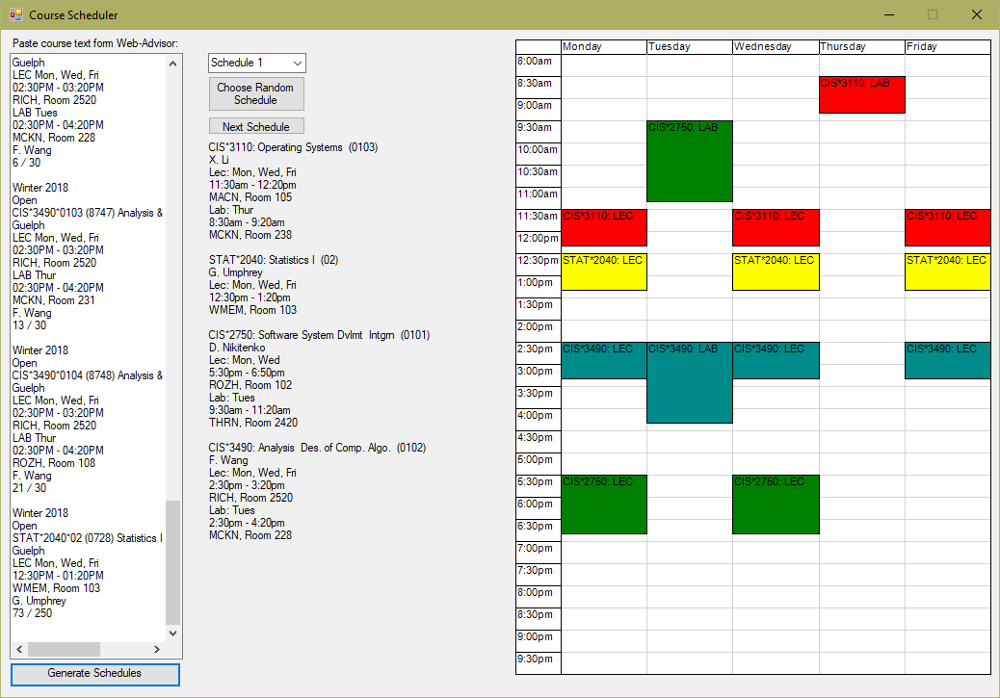

# Course Scheduler
Used to create a University class timetable. Given input from the University of Guelph's Web Advisor, the Course Scheduler will parse the text to create a list of every time slot for every class, whilst also storing useful information about the course, such as name, section, location, and instructor.

Armed with the time slots, the scheduler will then generate every possible timetable where no two time slots will have a conflict. The app will then display a dropdown containing every schedule and will provide a graphical representation of the selected schedule.

